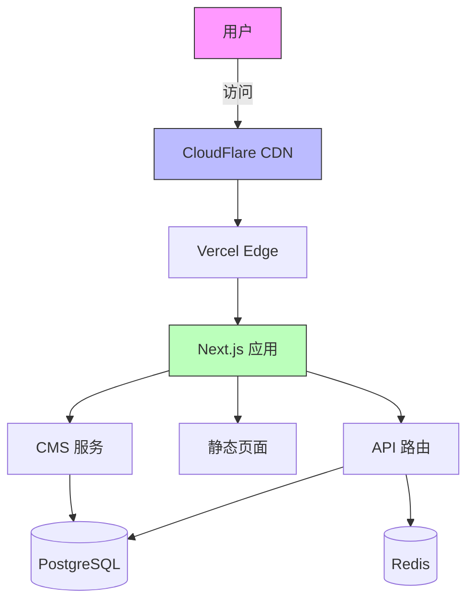
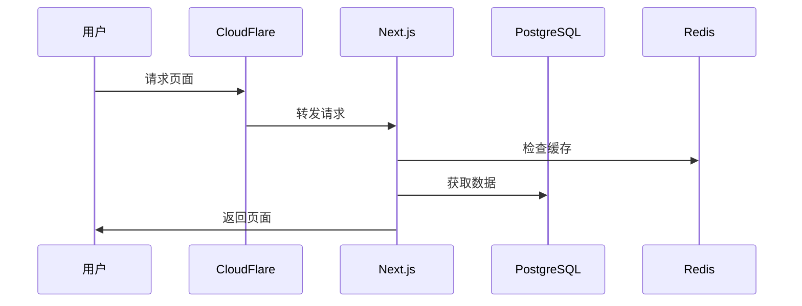

# 架构设计模板

<version>1.0.0</version>

## 基本要求

- 清晰记录架构决策
- 维护更新日志
- 合理使用 mermaid 图表

## 文档结构

### 必需章节

#### 1. 标题 {项目名称的架构设计}

#### 2. 文档状态

- 草稿
- 已批准

#### 3. 技术概述

#### 4. 技术选型表

列出语言、库、基础设施等技术选择的表格...

- 技术栈列
- 说明列

#### 5. 架构图表

- 根据需要使用 Mermaid 图表

#### 6. 数据模型、API 规范、数据结构等

- 不需要详尽无遗 - 但需要包含跨 Task 需要遵循的关键设计理念

#### 7. 项目结构

记录文件夹和文件的组织结构及其说明

#### 8. 更新日志

当文档不再是草稿状态并进行更新时，使用 Markdown 表格记录关键更改，表格包含更改标题、对应的 Task ID 以及在标题不够清晰时的补充说明

## 示例

<example>
# 公司官网架构设计

## 状态：已批准

## 技术概述

本架构设计定义了一个可扩展、高性能的现代化企业官网系统。采用微服务架构确保高可用性、可扩展性和可维护性，同时支持全球化部署和动态内容管理。

## 技术选型表

| 技术         | 说明                                           |
| ------------ | ---------------------------------------------- |
| Next.js      | React 框架，用于服务端渲染和静态页面生成       |
| Node.js      | 服务端运行环境                                 |
| PostgreSQL   | 主数据库，存储 CMS 和用户数据                  |
| Redis        | 缓存层，用于会话管理和高频访问数据             |
| TailwindCSS  | 原子化 CSS 框架，用于页面样式                  |
| Docker       | 容器化部署平台                                 |
| Vercel       | 主要部署和托管平台                             |
| CloudFlare   | CDN 和 DNS 管理                                |
| Prisma       | ORM 工具，用于数据库操作                       |
| Sentry       | 错误追踪和性能监控                             |

## 架构图





## 数据模型

### 页面内容模型

```json
{
  "page_id": "string",
  "slug": "string",
  "title": {
    "zh": "string",
    "en": "string",
    "ja": "string"
  },
  "content": {
    "sections": [
      {
        "type": "string",
        "data": "object"
      }
    ]
  },
  "metadata": {
    "seo": "object",
    "published_at": "datetime",
    "updated_at": "datetime"
  }
}
```

## 项目结构

```
/
├── /src
│   ├── /app          # Next.js 13+ App Router
│   ├── /components   # React 组件
│   ├── /lib         # 工具函数和共享库
│   └── /api         # API 路由处理
├── /public
│   ├── /images      # 静态图片资源
│   └── /locales     # 多语言文件
├── /prisma
│   └── schema.prisma # 数据库模型
└── /docs
    ├── /api         # API 文档
    └── /components  # 组件文档
```

## 更新日志

| 更新内容           | Task ID | 说明                                    |
| ----------------- | -------- | --------------------------------------- |
| 初始架构设计       | N/A      | 初始系统设计和文档                       |
| 添加 Redis 缓存层  | Task-8  | 引入 Redis 用于性能优化                 |
| 升级 Next.js      | Task-12 | 从 Next.js 12 升级到 13，采用 App Router |

</example>

<example type="invalid">
# 简单架构设计

用一个数据库和一些 API 就行。如果需要的话后面再加缓存。

技术栈：

- 用最简单的
- 可能用 MongoDB
- 随便什么框架

没有图表和正式文档。
</example>
